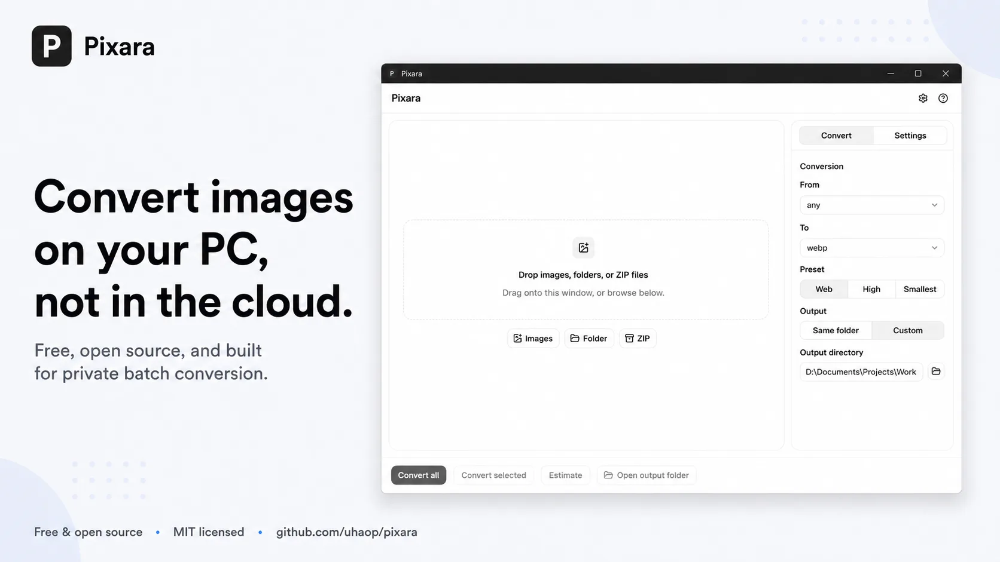
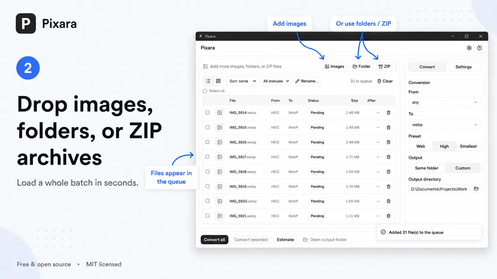
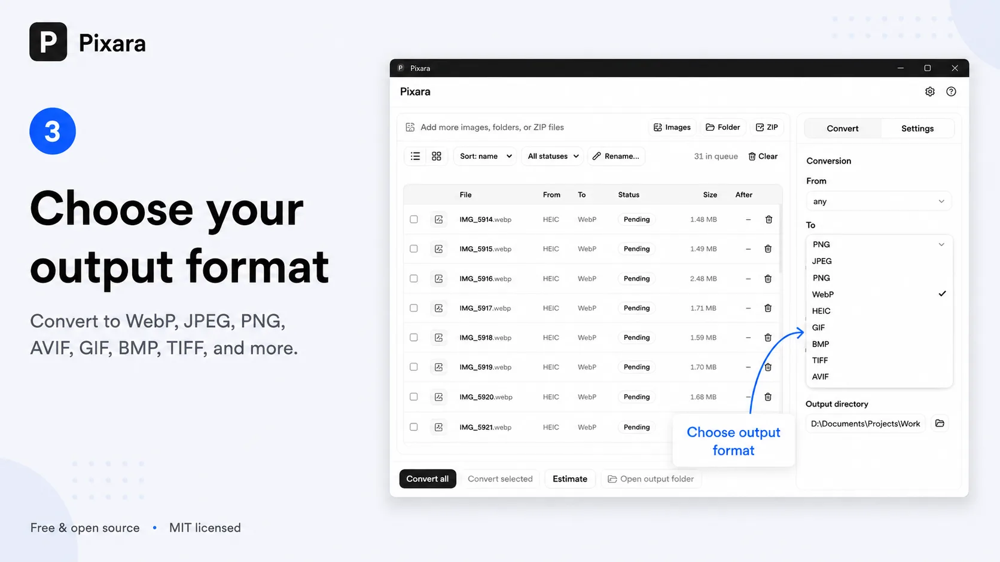
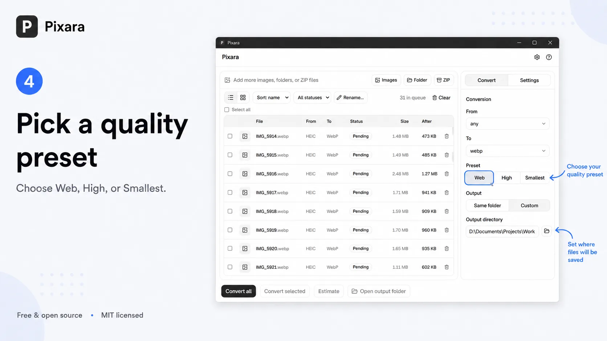
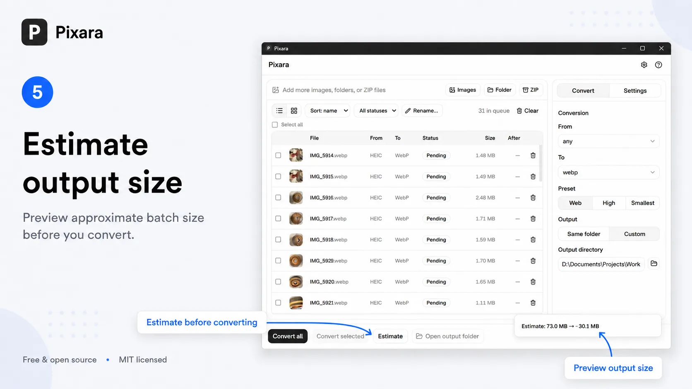
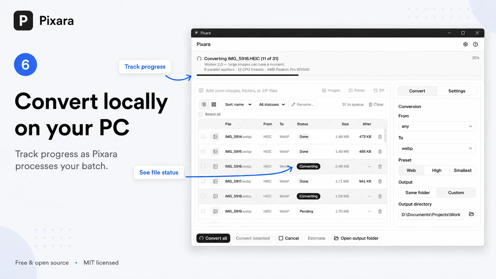
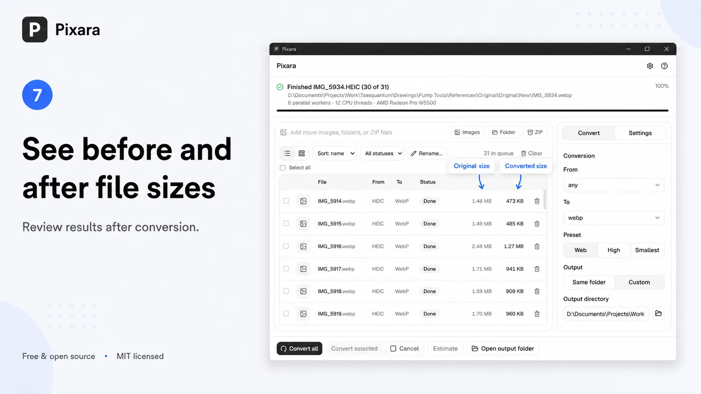
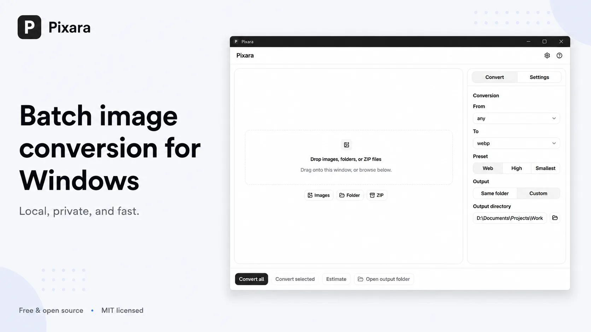

# Pixara

Batch image conversion for Windows. Drag and drop images, folders, or ZIP archives, pick an output format, and convert locally on your PC — not in the cloud.

**[Download latest release](https://github.com/uhaop/pixara/releases/latest)** — portable ZIP or installer.

## Quick start

1. Download and extract the portable ZIP, or run the installer.
2. Launch `pixara.exe`.
3. Follow the walkthrough below.

## Walkthrough



1. **Add images** — Drop files, folders, or ZIP archives (or **Images** / **Folder** / **ZIP**).

   

2. **Choose format** — Set **From** / **To** in the **Convert** panel (PNG, JPEG, WebP, AVIF, GIF, BMP, TIFF).

   

3. **Pick preset** — **Web**, **High**, or **Smallest**; **Same folder** or **Custom** output.

   

4. **Estimate** — Preview approximate batch size before converting.

   

5. **Convert** — **Convert all** or **Convert selected**; progress runs locally on your PC.

   

6. **Review** — Compare **Size** and **After** columns; **Open output folder** when done. Defaults live in **Settings** (tab or header gear).

   



## Supported formats

| Input | Output |
|-------|--------|
| PNG, JPEG, WebP, GIF, BMP, TIFF, AVIF | PNG, JPEG, WebP, GIF, BMP, TIFF, AVIF |

HEIC input is supported when Windows HEIC codecs are installed ([setup script](setup-windows-heic.ps1)).

---

## Build from source

For contributors and developers who want to run or package the app locally.

### Prerequisites

- [Node.js](https://nodejs.org/) 18+
- [Rust](https://rustup.rs/) (stable)
- Visual Studio 2022 Build Tools with the **Desktop development with C++** workload

The public repository is built **without** the default HEIC feature — no vcpkg or codec DLLs required for development.

### Development

```powershell
git clone https://github.com/uhaop/pixara.git
cd pixara
npm install
npm run tauri dev
```

### Release-style build (matches GitHub portable)

```powershell
powershell -NoProfile -ExecutionPolicy Bypass -File .\scripts\build-public.ps1
powershell -NoProfile -ExecutionPolicy Bypass -File .\scripts\pre-ship.ps1
```

Artifacts:

- `dist-public/Pixara/pixara.exe`
- `dist-public/Pixara-portable-win64.zip`

Maintainers: see [PUBLISHING.md](PUBLISHING.md).

---

## Links

|                         | URL                                                                                                |
| ----------------------- | -------------------------------------------------------------------------------------------------- |
| **Latest release**      | [https://github.com/uhaop/pixara/releases/latest](https://github.com/uhaop/pixara/releases/latest) |
| **Source code**         | [https://github.com/uhaop/pixara](https://github.com/uhaop/pixara)                                 |
| **Report an issue**     | [https://github.com/uhaop/pixara/issues](https://github.com/uhaop/pixara/issues)                   |
| **Privacy**             | [docs/PRIVACY.md](docs/PRIVACY.md)                                                                 |
| **Third-party notices** | [THIRD_PARTY_NOTICES.md](THIRD_PARTY_NOTICES.md)                                                   |
